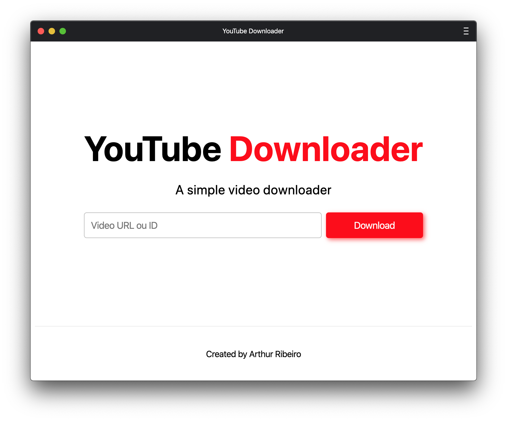

<div align="center">
  <a href="https://github.com/devarthurribeiro/RocketApi"></a>
  <h1 align="center">YouTube Downloader</h1>
  <br>
  <br>
  <p>
    <b>A YouTube video Downloader ⬇️</b>
  </p>
  <p>
    <i>Download videos from youtube quickly and simply 🚀</i>
  </p>
  <p>
    <sub>Built with ❤︎ by
      <a href="https://github.com/devarthurribeiro">Arthur Ribeiro</a>
    </sub>
  </p>
</div>

<div align="center">
  <br>
    
  <br>
</div>
 
 ---

## Development Server 🚀

First, run the development server:

```bash
npm run dev
# or
yarn dev
```

Open [http://localhost:3000](http://localhost:3000) with your browser to see the result.

## License 📝

This project is licensed under the [MIT License](https://opensource.org/licenses/MIT) - see the [LICENSE](LICENSE) file for details.

## Autor

<table>
  <tr>
    <td align="center"><a href="https://github.com/devarthurribeiro"><br /><sub><b>Arthur Ribeiro</b></sub></a><br /><a href="https://github.com/devarthurribeiro/covid19-brazil-api/commits?author=devarthurribeiro" title="Code">💻</a> <a href="#devarthurribeiro" title="Design">🎨</a></td>
  <tr>
</table>

